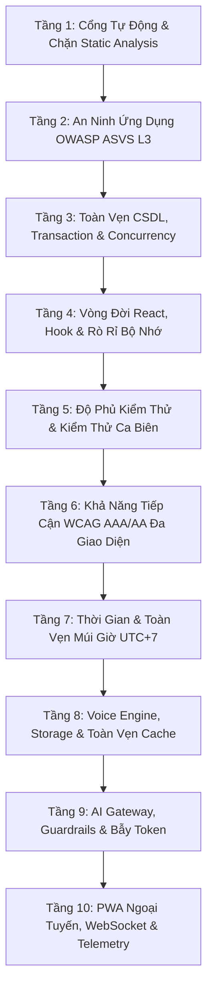

# AUDIT.md — Quy Trình Kiểm Toán & Dò Lỗi Vi Mô Toàn Diện (Micro-Level Deep Audit Framework)

> **TÀI LIỆU TIÊU CHUẨN CAO NHẤT VỀ KIỂM TOÁN VÀ DÒ TÌM LỖI VI MÔ (MICRO-BUGS) TRÊN TOÀN DỰ ÁN ĐỒNG HÀNH**.
> Quy trình này được thiết kế theo các tiêu chuẩn quốc tế khắt khe nhất (**OWASP ASVS Level 3**, **ISO/IEC 25010**, **W3C WCAG 2.2 AAA/AA**, **Google SRE Resilience Handbook**), nhằm **phát hiện và loại bỏ triệt để từng lỗi nhỏ nhất** trước khi code được phép triển khai lên Production.

---

## 0. Nguyên Tắc Kiểm Toán Cốt Lõi (Zero-Defect Core Principles)

1. **Bằng chứng thực nghiệm (Hard Evidence)**: Mọi kết luận "Đạt" bắt buộc phải đi kèm bằng chứng lệnh chạy thật (`exit code 0`, log output, hoặc test assertion). Nghiêm cấm mọi giả định "chắc là hoạt động" hay "không thấy lỗi".
2. **Dung sai tuyệt đối bằng 0 (Zero Tolerance)**:
   - 0 lỗi Typecheck (`tsc`), 0 cảnh báo Lint (`--max-warnings 0`), 0 lỗi Prettier.
   - 0 lỗi bảo mật (SQLi, IDOR, XSS, Secret Leak, Insecure Deserialization).
   - 0 sai lệch tính toán tài chính / đếm lượt / cập nhật tiến độ học tập.
   - 0 chu trình import (`cycles: 0`) và 0 route không được khai báo.
   - 0 lỗi nuốt ngoại lệ âm thầm (Silent Error Swallowing).
3. **Phân rã kiểm toán 2 chiều (Broad & Deep Dual Audit)**:
   - **Audit Rộng (Broad Audit)**: Quét tĩnh toàn bộ codebase theo 10 tầng tiêu chuẩn.
   - **Audit Sâu (Deep Data Flow Audit)**: Truy vết từng dòng code trên 8 luồng dữ liệu trọng yếu (Auth, Payment, Voice/TTS, Chat, SRS, State Persistence, Cross-Domain Graph, Automation).

---

## 1. Khung 10 Tầng Kiểm Toán Vi Mô (10-Layer Micro-Audit Matrix)



---

### TẦNG 1: Cổng Tự Động & Static Analysis Khắt Khe Nhất

| Chỉ tiêu               | Lệnh thực thi          | Tiêu chí đạt chuẩn                                          | Dấu hiệu lỗi vi mô cần bắt                                                 |
| :--------------------- | :--------------------- | :---------------------------------------------------------- | :------------------------------------------------------------------------- |
| **TypeScript Strict**  | `npm run typecheck`    | 0 errors trên cả 4 tsconfigs (`root`, `api`, `e2e`, `hub`). | Bất kỳ implicit `any`, type assertion ép kiểu nguy hiểm `as unknown as T`. |
| **ESLint Static Code** | `npm run lint`         | 0 errors, 0 warnings (`--max-warnings 0`).                  | Biến không dùng, hook dependency thiếu, `console.log` sót lại.             |
| **Prettier Format**    | `npm run format:check` | 100% matched Prettier style.                                | Khoảng trắng, ký tự điều khiển ẩn, xuống dòng không chuẩn.                 |
| **Unit & Integration** | `npm test`             | **100% test passed** (≥ 4.258 tests).                       | Unhandled promise rejections, test flaky, stderr bất thường.               |
| **Bundle Size Budget** | `npm run size`         | JS ≤ 123 kB, CSS ≤ 11 kB (Brotli).                          | Code-splitting hỏng khiến bundle phình to vượt ngân sách.                  |
| **Build Integrity**    | `npm run build`        | Thành công trọn vẹn cả Client, Server, Hub.                 | Lỗi đóng gói Vite, circular chunking warnings.                             |

---

### TẦNG 2: An Ninh Ứng Dụng & Kiểm Soát Quyền (OWASP ASVS Level 3)

| Nhóm vi phạm                      | Kỹ thuật quét vi mô                                            | Dấu hiệu lỗi vi mô                                                                                                |
| :-------------------------------- | :------------------------------------------------------------- | :---------------------------------------------------------------------------------------------------------------- |
| **1. SQL Injection**              | `grep -rn "query(" api/ packages/`                             | Nối chuỗi SQL (`+`, template `${var}`) thay vì truyền mảng tham số `[$1, $2]`.                                    |
| **2. IDOR / Quyền dữ liệu**       | Rà soát mọi API handler có nhận `id`, `userId`, `roomId`       | Sử dụng trực tiếp tham số người dùng truyền lên thay vì đối chiếu với `auth.userId` từ token xác thực của server. |
| **3. XSS (Cross-Site Scripting)** | `grep -rn "dangerouslySetInnerHTML" apps/`                     | Sử dụng HTML thô chưa được lọc qua bộ khử khuẩn DOMPurify.                                                        |
| **4. Lộ Secret / PII**            | `grep -rn "sk-\|AIza\|Bearer \|password" apps/ api/ packages/` | Hardcode API keys, in token/password ra console hoặc gửi PII lên Sentry logs.                                     |
| **5. CSRF & Token Spoofing**      | Kiểm tra header `Authorization` trong `validateAuth()`         | Chấp nhận request thay đổi trạng thái (POST/PUT/DELETE) chỉ dựa vào cookie không an toàn.                         |
| **6. Lỗ hổng Dependency**         | `npm audit --omit=dev`                                         | Tồn tại lỗ hổng cấp độ High hoặc Critical trong production dependencies.                                          |
| **7. Security Headers**           | Rà soát CSP trong `server.ts` & Nginx config                   | Thiếu `Strict-Transport-Security`, `X-Content-Type-Options: nosniff`, `Referrer-Policy` hoặc CSP lỏng lẻo.        |

---

### TẦNG 3: Toàn Vẹn CSDL, Transaction & Concurrency Vi Mô

1. **Tính Nguyên Tử (Atomicity) & Idempotency trong Thanh Toán**:
   - Mọi thao tác cộng gói học Pro/VIP, ghi nhận lịch sử `payment_history`, và cập nhật `users.plan` phải nằm trong khối `BEGIN ... COMMIT` của PostgreSQL transaction.
   - Webhook thanh toán (SePay/VietQR) phải kiểm tra trạng thái giao dịch trước khi xử lý, đảm bảo gọi lặp lại 10 lần vẫn chỉ cộng hạn sử dụng 1 lần.
2. **Ngăn Chặn Race Condition & Double-Submit**:
   - Ở phía client: Dùng synchronous ref locks (`submittingRef.current = true`) ngay tại sự kiện click, không phụ thuộc vào chu kỳ render của `useState`.
   - Ở phía server: Đếm lượt dùng AI phải diễn ra atomic trên PostgreSQL/Redis, có cơ chế hoàn lượt tự động (`0004_refund_usage`) khi AI provider trả lỗi 5xx.
3. **Hiệu Năng & Tránh Rò Rỉ Kết Nối (Connection Pool Leaks)**:
   - Mọi kết nối lấy từ `pool.connect()` bắt buộc phải có `client.release()` đặt trong khối `finally`.
   - Mọi bảng dữ liệu lớn (`tts_cache`, `chat_messages`, `learning_progress`) phải dùng **Keyset Pagination** (`WHERE id > $last_id`), cấm dùng `OFFSET` sâu gây quá tải CPU.
   - Tuyệt đối không để xảy ra truy vấn N+1 (quét lấy dữ liệu trong vòng lặp `for`/`map`).

---

### TẦNG 4: Vòng Đời React, Quản Lý Hook & Rò Rỉ Bộ Nhớ (Memory Leaks)

1. **Ngăn Chặn `setState` Sau Khi Unmount**:
   - Mọi tác vụ bất đồng bộ (gọi AI, TTS, fetch API) kéo dài trong React component phải sử dụng hook `useMountedRef()` hoặc `AbortController` để huỷ cập nhật state nếu người dùng đã rời trang.
2. **Tránh Stale Closures & Dependency Array Lệch**:
   - Rà soát toàn bộ `useEffect`, `useCallback`, `useMemo`: Khai báo đầy đủ các biến phụ thuộc trong dependency array.
   - Tránh khởi tạo object/array rỗng mới (`{}` hoặc `[]`) trực tiếp trong prop truyền xuống component con để tránh re-render thừa.
3. **Dọn Dẹp Tài Nguyên Hệ Thống (Clean-up Phase)**:
   - Dọn dẹp toàn bộ `addEventListener` (`window`, `document`), `setInterval`, `setTimeout` trong return cleanup function của `useEffect`.
   - Tắt mic và giải phóng Web Audio stream (`track.stop()`) ngay khi rời trang Speaking / Chat Voice.

---

### TẦNG 5: Độ Phủ Kiểm Thử & Kiểm Thử Ca Biên (Edge Cases)

1. **Ngưỡng Độ Phủ Kiểm Thử Cứng (Coverage Ratchet)**:
   - Statements ≥ 93% · Branches ≥ 89% · Functions ≥ 96% · Lines ≥ 93%.
2. **Ma Trận Kiểm Thử Ca Biên (Edge-Case Matrix)**:
   - **Phân biệt `null` vs `0` vs `undefined`**: Xử lý rạch ròi giữa "chưa từng học/chưa có dữ liệu" và "điểm số/lượt dùng bằng 0".
   - **Dữ liệu đầu vào bất thường**: Mảng rỗng `[]`, chuỗi rỗng `""`, chuỗi siêu dài (vượt 4.000 ký tự), ký tự Unicode đặc biệt, SQL injection payloads.
   - **Xử lý ngắt kết nối mạng**: Kiểm thử hành vi khi mạng bị ngắt giữa chừng lúc đang gửi tin nhắn chat, tải âm thanh, hoặc đồng bộ bài tập.

---

### TẦNG 6: Tiêu Chuẩn Khả Năng Tiếp Cận (WCAG AAA/AA)

Theo quy định nghiêm ngặt của W3C (_Understanding Conformance_):

1. **Nội dung văn bản & Tiêu đề (`h1-h6`, `p`, `li`, `blockquote`)**: Đạt chuẩn **WCAG AAA** (Tỷ lệ tương phản màu **≥ 7:1** trên mọi bề mặt nền).
2. **Thành phần tương tác & Điều khiển (Nav, Button, Input, Tag)**: Đạt chuẩn **WCAG AA** (Tỷ lệ tương phản **≥ 4.5:1**, Kích thước vùng chạm tối thiểu **≥ 44×44px** / `tap-44`).
3. **Không Lỗi Trên Cả 5 Giao Diện (Theme Consistency)**:
   - Kiểm thử tự động bằng Playwright Axe-core trên **15 trang chính × 5 giao diện** (_Xanh đêm, Blue sky, Hồng ngọt ngào, Rực rỡ, Nhi đồng_), đảm bảo đạt **0 vi phạm**.
   - Chú ý đặc biệt token màu `--c-white`: Khi chuyển sang theme sáng sẽ bị đảo màu, các nút cố định nền tối (OAuth, Brand buttons) phải dùng mã màu cứng `#fff`.

---

### TẦNG 7: Xử Lý Thời Gian & Toàn Vẹn Múi Giờ (UTC vs VN UTC+7)

- **Quy chuẩn ngày học**: Toàn bộ logic tính toán streak, reset lượt dùng hàng ngày, và biểu đồ học tập phải dùng helper chuẩn `vnDateStr()` (`src/lib/date.ts` & `packages/core-db/date.ts`).
- **Ngăn ngừa lỗi lệch múi giờ**: Cấm tuyệt đối dùng `new Date().toISOString().slice(0, 10)` (UTC gốc) cho nghiệp vụ tính ngày học, vì sẽ làm hoạt động từ 00:00 đến 07:00 sáng tại Việt Nam bị tính nhầm sang ngày hôm trước.

---

### TẦNG 8: Voice Engine, Mã Hóa & Toàn Vẹn Cache (TTS/STT Storage)

- **Mã hóa Audio**: Toàn bộ file phát âm lưu trữ trên VPS / Cloudflare R2 phải được mã hóa chuẩn **AES-256-GCM**, chỉ giải mã khi client có session token hợp lệ.
- **Chống lỗi "Cache HIT Giả"**: Hàm `isServableUrl()` kiểm tra tính hợp lệ của URL trong `tts_cache`. Nếu URL trỏ tới file local không tồn tại sau khi chuyển sang R2, hệ thống phải coi là Cache MISS để tự động sinh lại.
- **Chính sách bảo toàn Cache**: Không bao giờ áp dụng thuật toán xoá LRU cho phát âm từ điển (`pronunciations`) và mẫu câu; chỉ dọn dẹp các bản ghi mồ côi (orphan records) qua script xác minh.

---

### TẦNG 9: AI Gateway, Guardrails & Kiểm Soát Chi Phí

- **Giới hạn độ dài Input/Output**: Giới hạn tối đa 4.000 ký tự cho mỗi request chat/writing để tránh cạn kiệt token và tấn công DoS chi phí.
- **Chuỗi Fallback Đa Tầng**: Gateway AI tự động chuyển đổi nhà cung cấp dự phòng (`Groq Whisper` ⇄ `OpenAI Whisper`, `Gemini` ⇄ `Groq LLaMA` ⇄ `Claude`) với timeout xác định (tối đa 30s).
- **Đánh giá Prompt Regression**: Mỗi khi thay đổi prompt trong `src/prompts/`, bắt buộc chạy `npm run eval:tutor` để chứng minh precision/recall không bị suy giảm.

---

### TẦNG 10: PWA Ngoại Tuyến, WebSocket & Telemetry

- **Service Worker Cache Partitioning**: Phân định rạch ròi giữa `SHELL_CACHE` (app-shell cập nhật theo deploy) và `DATA_CACHE` (dữ liệu từ điển 15MB lưu trữ bền vững qua các lần deploy).
- **Quản lý WebSocket Lifecycle**: Tự động gửi heartbeat ping/pong mỗi 30s, tự động reconnect với exponential backoff, dọn dẹp presence khi socket đóng.
- **Push Notification Expired Cleanup**: Khi gửi Web Push nhận về mã lỗi HTTP `410 Gone` hoặc `404 Not Found`, hệ thống phải tự động xoá subscription hỏng khỏi database `push_subscriptions`.

---

## 2. Tập Lệnh Quét Tự Động Toàn Diện (Automated Audit Suite)

Chạy tuần tự toàn bộ bộ lệnh kiểm toán sau trong terminal:

```bash
# ── BƯỚC 1: Phân tích đồ thị quan hệ & Kiến trúc ────────────────────────────
npm run codemap
npm run codemap -- cycles      # Phải báo: Không có chu trình import
npm run codemap -- hotspots    # Rà soát các file có rủi ro cao nhất

# ── BƯỚC 2: Kiểm tra tĩnh, kiểu dữ liệu & định dạng ────────────────────────
npm run typecheck              # Phải báo: 0 errors trên 4 tsconfigs
npm run lint                   # Phải báo: 0 errors, 0 warnings
npm run format:check           # Phải báo: All matched files use Prettier style

# ── BƯỚC 3: Kiểm tra toàn bộ Test Suite & Độ phủ ───────────────────────────
npm test                       # Phải báo: 100% tests passed (≥ 4.258 tests)
npm run test:coverage          # Xác nhận vượt sàn 93/89/96/93%

# ── BƯỚC 4: Kiểm tra an ninh & Lỗ hổng Dependency ──────────────────────────
npm audit --omit=dev           # Phải báo: 0 vulnerabilities

# ── BƯỚC 5: Kiểm tra Build Production ──────────────────────────────────────
npm run build                  # Phải build thành công Client, Server, Hub
npm run size                   # Kiểm tra ngân sách bundle JS/CSS

# ── BƯỚC 6: Kiểm tra E2E & Khả năng tiếp cận (Accessibility) ───────────────
npm run test:e2e               # Playwright E2E & Axe-core A11y
```

---

## 3. Quy Trình Dò Lỗi Thủ Công Chuyên Sâu (Deep Code Inspection Checklist)

Sau khi các cổng tự động đạt 100%, kiểm toán viên/AI bắt buộc chạy các lệnh grep vi mô sau:

```bash
# 1. Quét tìm nối chuỗi SQL nguy hiểm
grep -rn "query(" api/ packages/core-db/ --include=*.ts | grep -v "\.test\." | grep -E "\+|`.*\\$"

# 2. Quét tìm lệnh shell / file path ghép chuỗi
grep -rn -E "exec\(|execSync\(|path\.join\(.*req\." api/ server.ts

# 3. Quét tìm XSS thô
grep -rn "dangerouslySetInnerHTML" apps/

# 4. Quét tìm console.log rác còn sót
grep -rn "console\.log" apps/english/src/ api/ packages/ --include=*.ts --include=*.tsx | grep -v "\.test\."

# 5. Quét tìm ép kiểu 'any'
grep -rn -E ":\s*any|as\s+any" apps/english/src/ api/ packages/ --include=*.ts --include=*.tsx | grep -v "\.test\."

# 6. Quét tìm bắt lỗi rỗng (Empty catch blocks)
grep -rn -A 2 "catch\s*(" api/ packages/ apps/english/src/ --include=*.ts --include=*.tsx | grep -B 1 "{\s*}"

# 7. Quét tìm ngày tháng dùng toISOString sai múi giờ VN
grep -rn "\.toISOString\(\)\.slice\(0,\s*10\)" apps/english/src/ api/ packages/ --include=*.ts --include=*.tsx | grep -v "\.test\."
```

---

## 4. Mẫu Báo Cáo Kiểm Toán Nghiêm Ngặt (Audit Report Template)

```markdown
=== BÁO CÁO KIỂM TOÁN CHẤT LƯỢNG TOÀN HỆ THỐNG ===
Thời gian kiểm toán: <YYYY-MM-DD HH:mm:ss UTC+7>
Nhánh kiểm toán: <branch_name> | Commit SHA: <commit_hash>

1. KẾT QUẢ CỔNG TỰ ĐỘNG (AUTOMATED GATES)

- TypeScript Typecheck: ✅ 0 errors (4 tsconfigs)
- ESLint Static Analysis: ✅ 0 errors, 0 warnings
- Prettier Formatting: ✅ 100% compliant
- Unit & Integration Tests: ✅ X / X passed (100%)
- Test Coverage: Statements X% | Branches X% | Functions X% | Lines X%
- Bundle Size: JS X kB / 123 kB | CSS X kB / 11 kB
- Production Build: ✅ Thành công Client, Server, Hub
- Dependency Security (npm audit): ✅ 0 vulnerabilities

2. KẾT QUẢ KIỂM TOÁN AN NINH & APPSEC

- SQL Injection / Parameterized Queries: ✅ 100% an toàn
- IDOR & Xác thực Server-side: ✅ 100% endpoints gọi validateAuth()
- XSS Prevention: ✅ 0 dangerouslySetInnerHTML không sanitize
- Hardcoded Secrets & PII Logging: ✅ 0 phát hiện

3. TOÀN VẸN CSDL & NGHIỆP VỤ CONCURRENCY

- Giao dịch thanh toán: ✅ Đảm bảo tính nguyên tử (Atomicity & Idempotency)
- Keyset Pagination: ✅ Đạt chuẩn trên toàn bộ bảng lớn
- Race Condition / Đếm lượt: ✅ Chặn double-submit đồng bộ

4. TRẢI NGHIỆM NGƯỜI DÙNG & ACCESSIBILITY

- Chu trình import (Codemap): ✅ 0 cycles
- Khả năng tiếp cận: ✅ WCAG AAA (Nội dung) & WCAG AA (Điều khiển)
- Tương thích 5 Themes: ✅ 0 lỗi vi phạm độ tương phản

5. HẠ TẦNG & DEEP HEALTH TELEMETRY

- Deep Health API (/api/health/deep): ✅ Status Healthy (DB ping < 5ms)
- Audio Storage & Mã hóa AES-256-GCM: ✅ Đạt chuẩn

KẾT LUẬN: SẴN SÀNG TRIỂN KHAI PRODUCTION 100% (ZERO DEFECTS)
```

---

## 5. Lịch Sử Khắc Phục Lỗi Qua Các Đợt Audit (Historical Evidence)

- **2026-08-18 (Platform Hardening & Deep Telemetry)**: Bổ sung endpoint `/api/health/deep`, tích hợp Web Push cho Chat ngoại tuyến, thêm `OfflineStatusBanner`, 4.258 tests pass 100%.
- **2026-08-04 (WCAG AAA Contrast Overhaul)**: Siết chặt cổng tương phản màu AAA (≥7:1) cho nội dung trên 5 theme, chuẩn hóa vùng chạm `tap-44`.
- **2026-07-14 (Gamification & Challenge Audit)**: Sửa lỗi cache transcript STT khi chấm lại, thêm khóa đồng bộ `submittingRef` chống double-click.
- **2026-07-06 (Bản Dịch & Từ Điển)**: Quét tự động 22.000 cặp Anh-Việt, chuẩn hóa ngữ nghĩa và nhãn giao diện.
- **2026-06-28 (Audit OWASP Toàn Diện v2)**: Vá triệt để các lỗi đếm lượt race-condition, bổ sung timeout fetch Google TTS, thiết lập RLS Postgres.
