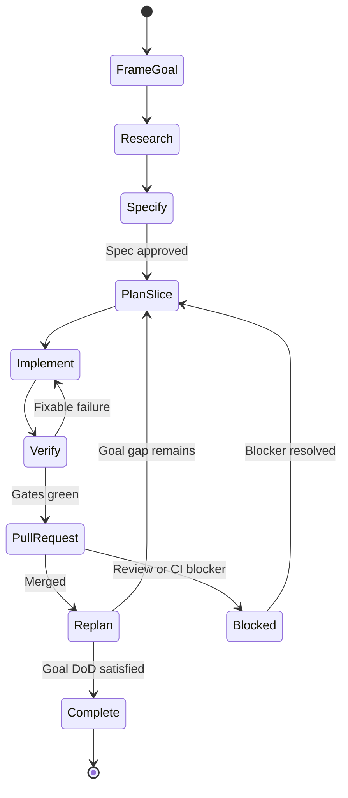

# Vòng lặp AI Delivery cho mục tiêu lớn

Tài liệu này định nghĩa cách AI lặp lại quy trình phát triển qua nhiều issue/PR cho đến khi đạt một
mục tiêu lớn hoặc Definition of Project Complete. Đây là vòng lặp **hữu hạn, có bằng chứng và có
điểm dừng**, không phải quyền tự ý thay đổi production.

## 1. Mô hình trạng thái



Mỗi vòng chỉ triển khai **một lát cắt nhỏ nhất có thể kiểm chứng**. Sau merge, AI đọc lại trạng thái
thật của `main`, đo khoảng cách tới mục tiêu và chọn vòng kế tiếp; không dựa vào ký ức phiên trước.

## 2. Ba tầng mục tiêu

| Tầng | Nội dung | Hoàn thành khi |
| --- | --- | --- |
| Goal | Outcome lớn của người dùng/sản phẩm | Goal metrics và guardrails đạt |
| Milestone | Capability có thể phát hành/đo độc lập | Milestone acceptance criteria đạt |
| Slice | Thay đổi nhỏ trong một PR | PR DoD đạt và merge |

Không dùng “đã viết hết code” làm tiêu chí hoàn thành. Mỗi tầng cần outcome, metric, acceptance
criteria, non-goals và bằng chứng.

## 3. Artifact bền vững

Mỗi goal có một file `docs/goals/<goal-id>.md` tạo từ `docs/goals/TEMPLATE.md`. File là checkpoint
duy nhất giữa các phiên AI và chứa:

- Goal DoD, metrics, guardrails, phạm vi và giới hạn quyền;
- danh sách milestone/slice cùng trạng thái và dependency;
- link research, spec, issue, PR, quyết định và bằng chứng;
- iteration log dạng append-only;
- current gap, next best slice, blocker và câu hỏi cần người quyết định.

Spec chi tiết của từng capability vẫn nằm ở `docs/specs/`. Không nhồi implementation detail vào
goal file và không tạo hai nguồn trạng thái cạnh tranh với `PROGRESS.md`.

## 4. Thuật toán mỗi vòng

1. **Reload truth:** checkout/pull `main`; đọc AGENTS, PROJECT, PROGRESS, goal, spec, issue/PR và CI.
2. **Reconcile:** đánh dấu item theo bằng chứng thật; không tin checklist cũ nếu code/test không khớp.
3. **Measure gap:** so current state với Goal DoD và guardrails.
4. **Stop check:** nếu Goal DoD đạt, chạy final audit và kết thúc; nếu có stop condition thì Blocked.
5. **Select slice:** chọn item ready có giá trị/risk-reduction cao nhất, không dependency mở và đủ nhỏ
   cho một PR. Không chọn chỉ vì dễ.
6. **Research + Spec:** với feature mới, nghiên cứu và merge spec được duyệt trước implementation.
7. **Plan:** ghi file ảnh hưởng, contract, acceptance tests, migration/rollout/rollback và budget vòng.
8. **Implement:** test-first khi sửa lỗi/logic; commit nhỏ; không mở rộng scope im lặng.
9. **Verify:** chạy impact map, targeted checks rồi full gate theo ma trận rủi ro; self-review diff.
10. **PR:** mở draft, gắn issue/spec; xử lý CI/review tới khi xanh trong phạm vi cho phép.
11. **Checkpoint:** sau merge, cập nhật goal/progress bằng kết quả thật, metric delta, quyết định và
    next slice; quay lại bước 1.

Pseudo-code:

```text
while not goal_done:
  state = reload_and_reconcile(main, goal_file, github)
  if stop_condition(state): checkpoint(BLOCKED); ask_owner(); break
  slice = choose_highest_value_ready_slice(state)
  if slice.is_feature and not slice.spec_approved: research_and_spec_only(); continue
  implement(slice)
  verify_repair_loop(max_attempts = 3)
  open_or_update_pr()
  if merge_not_authorized_or_checks_pending: checkpoint(WAITING); break
  after_merge_measure_and_checkpoint()
final_audit()
```

## 5. Vòng sửa lỗi bên trong một slice

AI được lặp tối đa 3 lần cho cùng một lỗi xác định:

1. lưu command, error và giả thuyết;
2. sửa nguyên nhân nhỏ nhất;
3. chạy lại test thất bại rồi gate liên quan;
4. nếu cùng lỗi còn sau 3 lần, hoặc sửa đòi đổi contract/scope, dừng và ghi blocker.

Không làm test xanh bằng cách xóa/skip test, hạ threshold, nới validation hoặc che lỗi nếu spec
không cho phép. Flaky test phải được chứng minh bằng nhiều lần chạy và có issue xử lý.

## 6. Chọn lát cắt kế tiếp

Chỉ item đạt DoR mới là candidate. Ưu tiên theo thứ tự:

1. security/data-loss/production correctness;
2. blocker mở khóa nhiều milestone;
3. bằng chứng giảm uncertainty lớn;
4. value người dùng cao với effort/risk nhỏ;
5. maintenance/debt có tác động đo được.

Nếu hai lựa chọn thay đổi kiến trúc hoặc product khác nhau đáng kể, AI trình bày trade-off và dừng
chờ owner; không tự suy đoán.

## 7. Budget và giới hạn

Mỗi vòng khai báo trước:

- tối đa một outcome và một PR;
- file/area dự kiến; mọi mở rộng scope phải checkpoint lại;
- tối đa 3 repair attempts cho một failure;
- validation bắt buộc;
- chi phí provider bằng 0 trong test;
- không dùng production data/secrets;
- không merge/deploy/modify production nếu chưa được user cấp quyền rõ ràng.

Có thể chuẩn bị backlog/spec của vòng sau trong khi chờ review, nhưng không xây code trên một base
chưa merge nếu tạo dependency hoặc conflict không cần thiết.

## 8. Điều kiện dừng bắt buộc

Dừng ở trạng thái `BLOCKED` và hỏi owner khi:

- spec chưa duyệt hoặc có quyết định product/architecture quan trọng còn mở;
- thay đổi destructive, breaking, schema không rollback an toàn, security/payment/user data;
- cần secret, production access, chi phí thật hoặc quyền mới;
- CI/review thất bại ngoài scope, cùng lỗi quá 3 lần, hoặc main thay đổi làm invalid plan;
- budget/guardrail vượt ngưỡng;
- không còn item Ready nhưng Goal DoD chưa đạt;
- bằng chứng mâu thuẫn với mục tiêu hoặc mục tiêu không còn hợp lý.

`WAITING` dùng khi chỉ chờ CI/review/merge. `COMPLETE` chỉ dùng sau final audit.

## 9. Definition of Goal Complete

Goal chỉ hoàn thành khi:

- mọi acceptance criterion có link bằng chứng trên `main`;
- target metric đạt trong cửa sổ đo đã định và guardrails không suy giảm;
- không còn milestone bắt buộc, blocker severity cao hoặc migration dang dở;
- CI/full regression, security/privacy, accessibility và operational checks liên quan xanh;
- production verification hoàn tất nếu goal bao gồm production;
- tài liệu/runbook/telemetry/rollback được cập nhật;
- final audit ghi rõ phần đã làm, phần không làm và residual risks;
- product owner xác nhận completion nếu goal yêu cầu quyết định kinh doanh.

Project complete là một Goal Complete đặc biệt bao phủ toàn bộ phạm vi đã duyệt, không phải trạng
thái “backlog trống”. Item ngoài scope được ghi riêng, không ngăn completion.

## 10. Báo cáo checkpoint chuẩn

Cuối mỗi vòng ghi vào goal file và PR:

```text
Iteration: <n> | State: PLANNING/BUILDING/VERIFYING/WAITING/BLOCKED/COMPLETE
Goal gap before/after:
Slice + spec/issue/PR:
Evidence: checks, test counts, metric delta
Risk/guardrail:
Decision made:
Blocker (nếu có):
Next best slice:
Permission needed:
```
