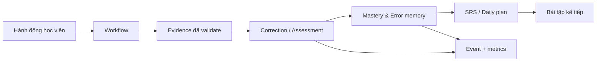

# English Tutor OS — Hướng dẫn thực thi và nghiệm thu

> Trạng thái: chuẩn điều hành cho lộ trình OS. Kế hoạch theo phase: [`OS_PHASE_BACKLOG.md`](./OS_PHASE_BACKLOG.md). Trạng thái thực tế: [`../PROGRESS.md`](../PROGRESS.md).

## 1. Mục đích và nguyên tắc

English Tutor OS là chương trình tách dần logic học tập khỏi handler/UI đang phục vụ người dùng thật, không phải dự án viết lại ứng dụng. Một phase chỉ được mở khi phase trước có bằng chứng đạt cổng; tài liệu, module rỗng hoặc test mock không phải bằng chứng hoàn tất.

Ưu tiên ra quyết định: không mất quyền lợi/dữ liệu học viên → không làm sai kết quả học → kiểm soát chi phí AI → giữ tương thích → tốc độ phát triển. Khi có đánh đổi đáng kể, tạo ADR trước khi code.

## 2. Nguồn sự thật và trạng thái

| Nguồn                          | Dùng để trả lời                                     | Không dùng để trả lời       |
| ------------------------------ | --------------------------------------------------- | --------------------------- |
| `PROGRESS.md`                  | phase đang làm, blocker, owner, bằng chứng mới nhất | lịch sử chi tiết mọi PR     |
| `OS_PHASE_BACKLOG.md`          | phạm vi, đầu ra và cổng mỗi phase                   | trạng thái đã triển khai    |
| `MASTER_SPEC.md`               | nguyên tắc kiến trúc bất biến                       | checklist thực thi chi tiết |
| ADR                            | quyết định đã chốt và đánh đổi                      | nhật ký tiến độ             |
| Test/eval/production dashboard | bằng chứng hành vi và vận hành                      | ý định thiết kế             |

Chỉ dùng `not_started`, `in_progress`, `blocked`, `accepted`. `accepted` đòi toàn bộ DoD; không dùng trạng thái “gần xong”. Mỗi phase có một owner chịu trách nhiệm cập nhật trạng thái và liên kết bằng chứng.

```md
| Phase | Status      | Owner  | Evidence              | Open risk / blocker          | Next gate         |
| ----- | ----------- | ------ | --------------------- | ---------------------------- | ----------------- |
| 00    | in_progress | <name> | commit…, test report… | production AI metrics absent | baseline sign-off |
```

## 3. Cổng bắt buộc

### Trước khi bắt đầu

- Có problem statement, luồng/người dùng chịu ảnh hưởng, chỉ số thành công.
- Có scope, non-goals, dependency, data owner và rollback owner.
- Đã chạy `npm run codemap -- impact <file>` cho mọi hotspot dự kiến sửa.
- Chạm auth, payment, personal data, migration, pricing, prompt/model: có ADR hoặc xác nhận chủ dự án.
- Có chiến lược tương thích dữ liệu cũ và feature flag khi không rollback tức thì.

### Trước khi merge

- Code nhỏ nhất đáp ứng contract; không tạo abstraction chưa có consumer thật.
- Unit test luật nghiệp vụ, validation, race/idempotency và ca lỗi.
- Integration test với Postgres test cho transaction/migration có liên quan.
- E2E/smoke cho happy path và failure path nếu chạm UI/API.
- Build, typecheck, lint, format, unit và E2E xanh trên merge candidate.
- Không lộ secret; input validate; query parameterized.

### Trước khi accepted

- Đủ deliverable trong backlog, link commit/PR/test report.
- Metric/log production chứng minh hành vi trong cửa sổ quan sát đã định.
- Rollback/migration/backfill rehearsal an toàn.
- Nợ còn lại có owner, hạn xử lý và phase đích.
- Cập nhật `PROGRESS.md`, ADR và contract cùng thay đổi code.

## 4. Contract dùng chung

### Định danh, thời gian và dữ liệu

- Entity bền vững có `id`, `user_id` khi thuộc học viên, `created_at`, `updated_at`; lưu thời gian UTC/timestamptz.
- Merge đa thiết bị phải có quy tắc xác định và conflict test. Không dùng email làm khóa nghiệp vụ/quyền.
- `learner_profile` chỉ giữ mục tiêu/sở thích/năng lực tổng hợp; skill, knowledge, evidence, error, memory là entity versioned riêng.
- Xóa/ẩn dữ liệu có audit record và retention policy. Không log raw transcript/audio/secret nếu không cần.

### API và lỗi

API mới dùng envelope versioned:

```ts
type ApiSuccess<T> = { ok: true; data: T; requestId: string }
type ApiFailure = {
  ok: false
  error: { code: string; message: string; retryable: boolean; details?: Record<string, string> }
  requestId: string
}
```

`message` an toàn cho client; `code` ổn định; client không branch theo câu chữ. Mutation retryable cần idempotency key. Breaking API phải version hoặc chạy song song đủ thời gian migration.

### Event

```ts
type DomainEvent<T> = {
  id: string
  name: string // e.g. learning.evidence.recorded
  schemaVersion: 1
  occurredAt: string
  actor: { userId: string; source: 'learner' | 'system' | 'admin' }
  correlationId: string
  payload: T
}
```

Producer ghi event cùng transaction với state thay đổi hoặc qua outbox; consumer idempotent theo `event.id`. Event schema mới cần validator, fixture và compatibility test; không có access token, API key, audio base64 hay transcript đầy đủ khi chưa có consent/retention rõ ràng.

### AI

Mọi AI call qua provider gateway có task, model policy, input đã giới hạn, timeout, correlation/idempotency id, cost estimate, provider/model, latency và failure class. Output AI không trực tiếp quyết định quyền, thanh toán hoặc state học viên nếu chưa validate schema. Kết quả chấm/sửa lưu prompt/model-policy version và evidence reference; retry chỉ cho lỗi retryable.

## 5. Luồng học và ranh giới quyền



Agent chỉ đề xuất. Domain engine/policy mới validate và commit. Không agent nào trực tiếp ghi mastery, permission, billing hoặc learner truth. Mỗi tool agent có input/output schema, quyền đọc/ghi, timeout, budget, fallback và audit trail.

## 6. Transaction, outbox và tiền

- Payment status, entitlement, usage debit/refund và learning record liên quan phải atomic hoặc có state machine + outbox/reconciliation rõ ràng.
- Không đánh dấu terminal state (`paid`, `completed`, `granted`) trước khi side effect bắt buộc thành công.
- Retry an toàn bằng unique provider transaction/idempotency key, update predicate/row lock và concurrent test.
- Webhook cần dashboard `pending`, `processing`, `failed`, `paid-but-ungranted`, retry count và alert.

## 7. Kiểm thử và môi trường

| Lớp              | Mục tiêu                            | Hạ tầng tối thiểu                                            |
| ---------------- | ----------------------------------- | ------------------------------------------------------------ |
| Unit             | luật thuần, validator, mapping      | mock ranh giới ngoài, không mock logic cần kiểm              |
| Integration      | DB, transaction, migration, handler | Postgres disposable + provider fake                          |
| Contract         | API/event/provider                  | fixture versioned + schema validation                        |
| E2E              | luồng người dùng                    | server giống production, test DB, rate-limit namespace riêng |
| Production smoke | deploy/config/secret/quyền          | account test, không dùng dữ liệu thật                        |

E2E không dùng chung `clientIp=unknown` cho workers. Test server phải forward Cookie/Origin giống Express hoặc chạy Express thật. Failure log do thiếu DB/key phải làm test fail nếu scenario tuyên bố kiểm tra tính năng đó.

## 8. Observability, chi phí và SLO

Endpoint/worker quan trọng có request ID, structured log redacted, counter success/failure, latency histogram và business metric. Tối thiểu theo dõi login, API 4xx/5xx, provider fallback/error, AI cost, TTS cache, SRS due/completed, migration, payment reconciliation và backup. Đặt alert cho payment reconciliation, 5xx tăng, quota và backup fail.

Ghi SLO số cụ thể trước rollout (p95 endpoint/AI, error budget, recovery time). Không tuyên bố hardening/scale chỉ từ unit test.

## 9. Migration và rollback

1. Additive migration: bảng/cột/index mới, backfill idempotent, dual read.
2. So sánh số liệu cũ/mới, có repair job trước đổi source of truth.
3. Feature flag/canary, quan sát metric.
4. Xóa đường cũ sau retention window và rollback/recovery rehearsal.

Migration phải ghi lock/timeout impact, backup trước chạy và command kiểm chứng sau chạy. Nếu dữ liệu không thể rollback, ghi recovery procedure, không gọi đó là rollback.

## 10. Mẫu implementation brief

```md
# Phase NN — Tên

## Problem and outcome

## Scope / non-goals

## Current-state evidence and dependencies

## Domain model, API and event contracts

## Architecture and repository touchpoints

## Security, privacy, cost and failure policy

## Migration / rollout / rollback

## Test matrix and measurable acceptance criteria

## Observability and operational runbook

## Deliverables, owner, commit boundary and next gate
```

Heading không áp dụng phải ghi `N/A` và lý do, để reviewer phân biệt “đã cân nhắc” với “bị quên”.
