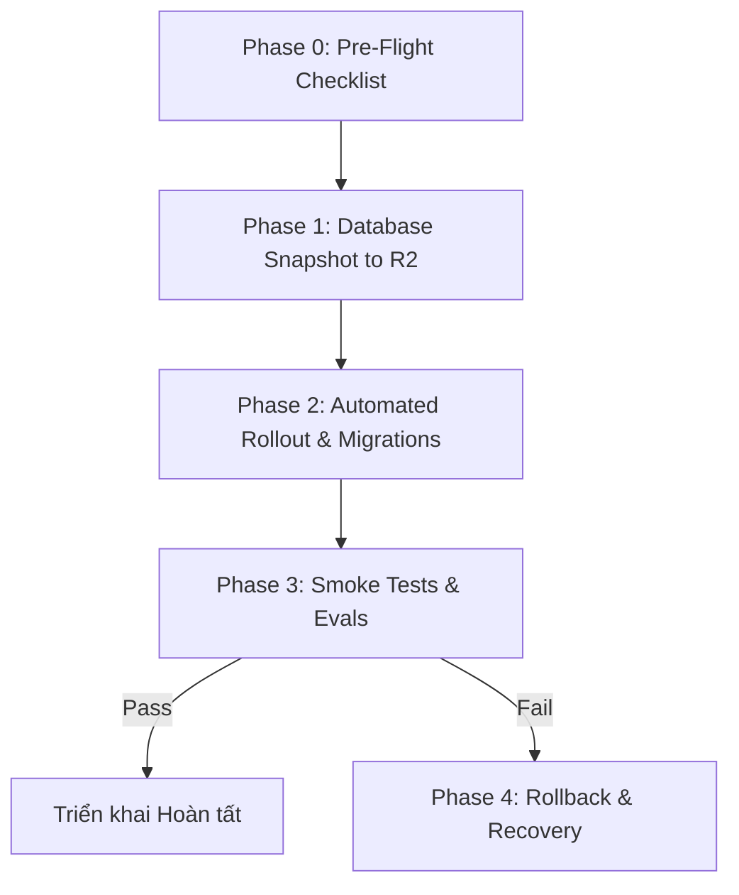

# Runbook Triển Khai Production & Migration Cho Đồng Hành Platform V2

**Phiên bản áp dụng:** Platform V2 (V2-01 đến V2-20)  
**Ngày hiệu lực:** 2026-08-17  
**Mục tiêu:** Hướng dẫn triển khai an toàn, bảo đảm tính toàn vẹn dữ liệu, zero-downtime reload và quy trình rollback khẩn cấp cho toàn bộ 13 PostgreSQL schemas trên VPS.

---

## 1. Kiến Trúc & Danh Sách Schemas Platform V2

Platform V2 bổ sung 6 schemas chuyên biệt mới trên PostgreSQL tự host:

| Schema     | Vai trò                                                | Bảng chính                                                                                                                                                                                                   |
| ---------- | ------------------------------------------------------ | ------------------------------------------------------------------------------------------------------------------------------------------------------------------------------------------------------------ |
| `personal` | Personal World Model, Life Graph, Policies, Automation | `persons`, `personal_facts`, `consent_grants`, `personal_policies`, `life_graph_nodes`, `life_graph_edges`, `memory_records`, `proposed_actions`, `decision_records`, `automation_grants`, `action_receipts` |
| `career`   | Quản lý lộ trình sự nghiệp & kinh nghiệm               | `career_profiles`, `career_experiences`, `career_goals`                                                                                                                                                      |
| `work`     | Không gian làm việc, dự án & biên bản họp              | `projects`, `tasks`, `meetings`, `documents`                                                                                                                                                                 |
| `startup`  | Quản lý dự án khởi nghiệp & kiểm chứng giả thuyết      | `ventures`, `problems`, `hypotheses`, `evidence`                                                                                                                                                             |
| `life`     | Kế hoạch cuộc sống, thói quen & sức khỏe               | `plans`, `habits`, `habit_logs`, `wellbeing_checks`, `growth_milestones`                                                                                                                                     |
| `platform` | Nhật ký vận hành nền tảng & audit quyền riêng tư       | `person_erasure_log`                                                                                                                                                                                         |

_Các schema gốc (`public`, `english`) tiếp tục phục vụ ứng dụng học tiếng Anh như cũ mà không bị gián đoạn._

---

## 2. Quy Trình 4 Giai Đoạn Triển Khai (4-Phase Deployment Protocol)



---

### Phase 0 — Pre-Flight Checklist (Kiểm tra trước khi triển khai)

1. **Kiểm tra môi trường VPS**:
   ```bash
   node -v   # Phải >= v22.0.0
   npm -v
   pm2 status
   ```
2. **Kiểm tra dung lượng đĩa & RAM**:
   ```bash
   df -h /
   free -m
   ```
3. **Kiểm tra tính an toàn của các migration files**:
   ```bash
   npm run migrate:verify
   ```

---

### Phase 1 — Database Snapshot & Backup lên Cloudflare R2

Trước khi chạy bất kỳ thay đổi nào, thực hiện snapshot toàn bộ cơ sở dữ liệu lên Cloudflare R2:

```bash
# Trên VPS:
npm run backup:r2
```

_Xác nhận log trả về `Backup PostgreSQL lên Cloudflare R2 thành công` kèm mã hash dump._

---

### Phase 2 — Automated Rollout & Zero-Downtime Reload

Thực hiện triển khai code mới và áp dụng migrations:

```bash
cd /var/www/english-tutor
bash scripts/deploy.sh
```

**Các bước tự động của `deploy.sh`**:

1. Đồng bộ git: `git reset --hard origin/main`
2. Dọn sạch build cache: `rm -rf dist`
3. Cài đặt dependencies: `npm ci`
4. Áp dụng migrations tự động: `npm run migrate:pg` (thực thi các file từ `0041` đến `0052`)
5. Build production bundles: `npm run build` (bao gồm `english` và `apps/hub`)
6. Reload PM2 cluster zero-downtime: `bash scripts/pm2-reload.sh`

---

### Phase 3 — Post-Deployment Verification & Smoke Tests

Chạy kiểm tra sức khỏe và các endpoint đa domain:

1. **Kiểm tra Health Endpoint**:
   ```bash
   curl -s https://en-vi.donghanhcungban.com/api/health
   # Kỳ vọng: {"status":"ok", ...}
   ```
2. **Kiểm tra Hub Apex Host Routing**:
   ```bash
   curl -s -H "Host: donghanhcungban.com" http://localhost:3001/ | grep -o "<title>[^<]*</title>"
   ```
3. **Chạy bộ kiểm thử tự động V2 Audit**:
   ```bash
   npm run eval:v2:audit
   ```
   _Yêu cầu 8/8 Acceptance Criteria PASSED (100%)._

---

## 3. Quy Trình Xử Lý Sự Cố & Rollback Khẩn Cấp (Phase 4)

Nếu phát hiện lỗi nghiêm trọng sau khi triển khai:

### 1. Rollback Code & PM2

```bash
git checkout <commit-id-trước-đó>
npm ci
npm run build
pm2 reload ecosystem.config.cjs
```

### 2. Khôi phục Cơ Sở Dữ Liệu từ Snapshot R2 (nếu có lỗi schema/dữ liệu)

```bash
# Liệt kê các bản backup gần nhất
npm run restore:r2 -- --list

# Khôi phục từ bản backup an toàn nhất
npm run restore:r2 -- --latest
```

---

## 4. Bảng Kiểm Tra Hoàn Tất Triển Khai (Sign-Off Checklist)

- [ ] `npm run migrate:verify` xanh 100%.
- [ ] Snapshot R2 tạo thành công trước khi deploy.
- [ ] 52 migrations áp dụng thành công không có lỗi syntax/FK.
- [ ] PM2 reload trong cluster mode không gián đoạn kết nối.
- [ ] `curl /api/health` trả status `ok`.
- [ ] Hub (`donghanhcungban.com`) và English App (`en-vi.donghanhcungban.com`) truy cập bình thường.
- [ ] `npm run eval:v2:audit` đạt 8/8 criteria.
